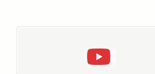

# CSS Grundlagen

Ziel dieser Aufgabe ist es, Erfahrung mit grundlegenden Möglichkeiten bei der Gestaltung von HTML-Seiten mittels Cascading Style Sheets (CSS) zu sammeln.

## Aufgabenstellung 

Sie gestalten eine auf HTMl und CSS basierende digitale Visitenkarte, analog zum abgebildeten Beispiel: 


* Geben Sie neben Ihrem Namen, dem Studiengang als auch Ihrem Fachsemester den Grund an, weshalb Sie sich für dieses Fach entschieden haben (Dieser Punkt fließt nicht in die Bewertung ein, freut Ihren Dozenten jedoch ungemein).

* Nutzen Sie möglichst ein Bild von sich (die Bilder werden ausschließlich kursintern verwendet).

* Achten Sie auf eine möglichst exakte Darstellung der Vorlage. Abweichungen führen zu Punktabzug.

* Bei einem Maus-Click auf die Box mit dem GitLab Icon wird die Git Seite der Hochschule (https://git.it.hs-heilbronn.de) angezeigt.

* Fährt die Maus über die Box mit dem GitLab Icon, wird eine Animation analog zum folgenden Beispiel angezeigt: 

    

* Ihre gesamte Karte befindet sich innerhalb eines Tags: 

    ```html
    <div class="card" id="<matrikelnummer>">
    ...
    </div>
    ``` 

* <matrikelnummer> ersetzen Sie durch Ihre Matrikelnummer, z.B. `ìd="123456"`. 

* Hinterlegen Sie in Ihrer CSS-Datei **keinen** Selektor für die Klasse `card`. 

* Bei der Gestaltung des HTML-Codes als auch der CSS-Klassen sind Sie freigestellt.

* Ihre HTML-Datei benennen Sie `<matrikelnummer>.html`, Ihre CSS-Datei `<matrikelnummer>.css` (z.B. `123456.hmlt`und `123456.css`), die Datei liegt im gleichen Verzeichnis wie Ihre HTML-Datei.  

* Binden Sie die die Datei mittels ` <link rel="stylesheet" href="<matriklenummer>.css">` ein. 

* Hinterlegen Sie Ihr Photo nach dem gleichen Schema wie die CSS-Datei und benennen diese Datei `<matriklenummer>.png` oder `<matrikelnummer>.jpg`. Die Datei liegt ebenfalls im gleichen Verzeichnis wie Ihre HTML Datei.

* Für das GitLab Icon nutzen Sie das Icon unter: https://about.gitlab.com/images/press/logo/png/gitlab-icon-rgb.png. Legen Sie die Datei im gleichen Verzeichnis wie Ihre HTML Datei ab. Benennen Sie die Datei **nicht** um. 

* Ihr CSS darf *keine* Fehler und Warnings gemäß CSS Level 3 + SVG enthalten. Die Validierung findet mittels des W3C-Validators https://jigsaw.w3.org/css-validator/ statt.

# Abgabe 

* Packen Sie alle vier Dateien in ein ZIP.
* Laden Sie die Datei in der hierfür vorgesehen Aufgabe in ILIAS hoch.
* Stellen Sie sicher, dass die Dateien direkt entpackt werden (kein Unterorder etc.).
* Nutzen Sie kein RAR, TAR etc. Andere Archiv-Formate können nicht automatisiert entpackt und somit gewertet werden.
* Nutzen Sie keine passwortgeschützten ZIP-Dateien. Passwortgeschützte Dateien werden nicht gewertet.
* Senden Sie keine Lösungen per E-Mail ein, per E-Mail eingereichte Lösungen werden nicht gewertet.

# Bewertung 

* Für jede Abweichung von der Design-Vorlage bzw. den Anforderungen werden Punkte abgezogen. 
* Dateien die falsch oder nicht fristgemäß abgegeben wurden, werden **nicht** bewertet. 
* Prüfen Sie Ihre ZIP-Datei vor der Abgabe, korrupte ZIP-Dateien werden nicht bewertet.
