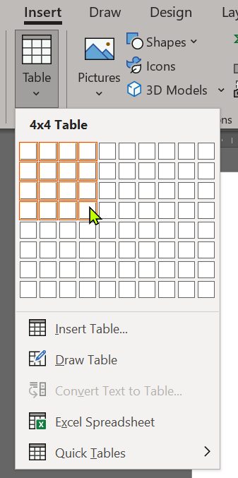
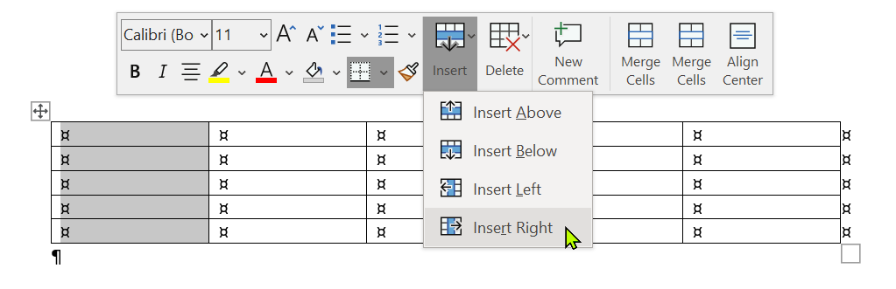

# JavaScript und DOM Grundlagen

Ziel dieser Aufgabe ist es, Erfahrung mit grundlegenden Möglichkeiten bei der Modifikation von HTML-Seiten mittels dem Document Object Model (DOM) und JavaScript zu sammeln.

## Aufgabenstellung 

Sie schreiben JavaScript-Funktionen, die es ermöglichen eine Tabelle direkt auf einer Webseite anzulegen und zu modifizieren. 

* Bei der Anlage der Tabelle wird die Anzahl der Spalten und Zeilen spezifiziert.  

* Es kann eine zusätzliche Reihe am Ende der Tabelle eingefügt werden.
* Es kann eine zusätzliche Reihe am Anfang der Tabelle eingefügt werden.
* Es kann eine zusätzliche Spalte am Ende der Tabelle eingefügt werden.
* Es kann eine zusätzliche Spalte am Anfang der Tabelle eingefügt werden. 


*Hinweis: Die Abbildungen oben dienen rein zur Erläuterung, es wird für diese Aufgabenstellung keine komplexe UI erwartet.*

Sie können folgende HTML-Seite als Ausgangspunkt für Ihre Lösung nutzen:

```html
<!DOCTYPE html>
<html>
  <head>
    <meta charset=utf-8 />
      <title>Lab 02: JavaScript und DOM</title>
      <style type="text/css">
        body {margin: 30px;}
      </style>  
  </head>
  <body>
    <table id="myTable" border="1">
    </table>
    <form>
    <input type="button" onclick="createTable()" value="Tabelle anlegen">
    ...
    </form>
  </body>
</html>
```

# Abgabe 

* Die Abgabe erfolgt als Check-in via Git im hochschuleigenen GitLab und im hochschuleigenen Commit-System
* Sie übermitteln im Commit-System ihren entsprechenden Commit-Hash
* Änderungen nach diesem HAsh werden in der Bewertung nicht berücksichtigt bzw. haben keine Auswirkungen darauf 
* Senden Sie **keine** Lösungen per E-Mail ein, per E-Mail eingereichte Lösungen werden nicht gewertet.

# Bewertung 

* Für jede Abweichung von der geforderten Funktionalität werden Punkte abgezogen. 
* Dateien die falsch oder nicht fristgemäß eingecheckt wurden, werden **nicht** bewertet. 
