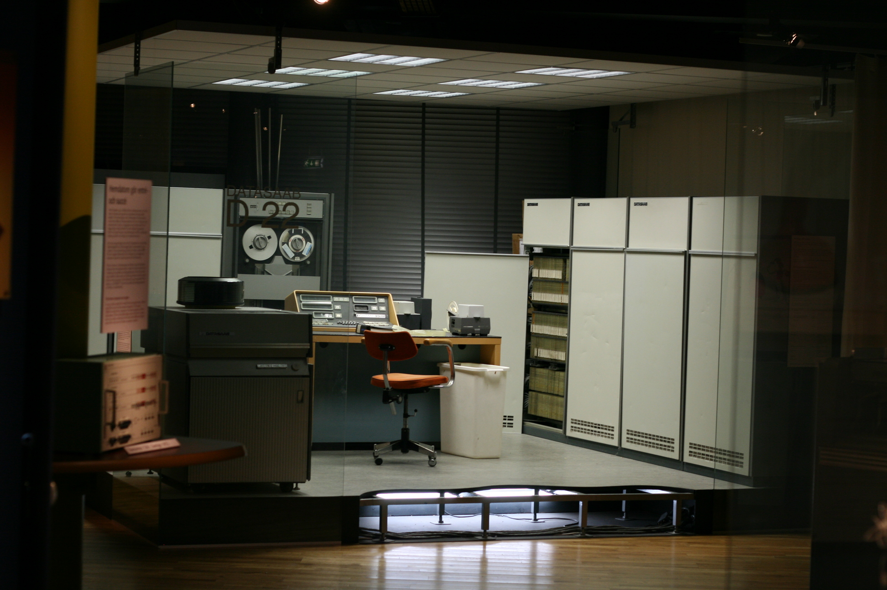
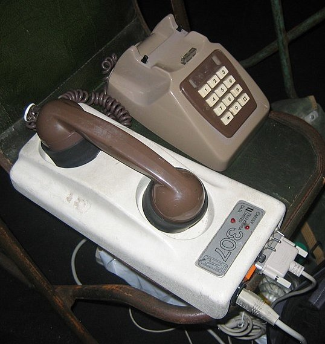

---

marp: true
theme: defalut
paginate: true
footer:

---

# Geschichte des WWW
Prof. Dr.-Ing. Andreas Heil

 Licensed under a Creative Commons Attribution 4.0 International license. Icons by The Noun Project.

v1.0.0

---

# Lernziele und Kompetenzen 

Die Anfänge des World Wide Webs **kennen lernen**.

---

<!-- footer: Quelle Cover: https://www.harpercollins.com/products/weaving-the-web-tim-berners-lee?variant=32117641347106
 -->

# Waving the Web

**Weaving the Web**
Tim Berners-Lee
Englische Ausgabe
Harper Business, 2007 
ISBN 9780062515872[^1]

---

<!-- footer: "" -->

# Was ist das Internet?

* Das Internet ist mehr als Facebook, Instagram, WhatsApp, Amazon, SnapChat, TikTok, Twitter und League of Legends.

* Das Internet ist zunächst ein globales Netzwerk miteinander verbundener Netzwerke (*Inter*nconnected *Net*works). 

* Entstanden ist das Internet 1969 – damals noch als *ARPANET*.

* Damals bestehend aus University of California Los Angeles (UCLA), Stanford, University of California Santa Barbara (UCSB) und der University of Utah.

---

<!-- footer: Von LA2 - Eigenes Werk, CC SA 1.0 https://commons.wikimedia.org/w/index.php?curid=3188109 -->

# Wie sahen früher eigentlich Computer aus?

In den 1960ern und 1970ern keine Personal Computer, nur sog. Mainframes.

---

<!-- footer: Microsoft Azure Blade, Quelle: Scott Hanselman https://www.youtube.com/watch?v=BO6jvQ88ICQ&t=968s
 -->

# Wie sahen früher eigentlich Computer aus?

Zum Vergleich heute: Azure Blade mit einem Vielfachen an Rechenleistung, Möglichkeiten zur Virtualisierung…

---

<!-- footer: By Dr. Bernd Gross - Own work, CC BY-SA 4.0, https://commons.wikimedia.org/w/index.php?curid=46947490 -->

# Computer in den 1970ern

Mitte 1970er, Altair 8800, blinkende Lichter, kein Netzwerk.

---

<!-- footer: By Narnars0 - Own work, CC BY-SA 3.0, https://commons.wikimedia.org/w/index.php?curid=32247697 -->

# Computer in den 1970ern

Ende 1970er, Apple 2, einer der ersten »richtig benutzbaren« Rechner.

---

<!-- footer: "" -->

# Internet in den 1970ern

* 1972: Telnet[^2] (ermöglichte die Verbindung auf Rechner über das Netzwerk)
    * https://tools.ietf.org/html/rfc97
* 1972: E-Mail 
* 1973: ARPANET wird international 
* 1973: FTP[^3] (File Transfer Protocol) 
    * https://tools.ietf.org/html/rfc114

---

# Computer in den 1980ern

1981: Xerox Star

<!-- footer: Von, Amber Case, https://www.flickr.com/photos/caseorganic/5628823118 CC BY-NC 2.0, https://creativecommons.org/licenses/by-nc/2.0/ -->

---

# Computer in den 1980ern

1981: IBM PC

<!-- footer: By Bundesarchiv, B 145 Bild-F077869-0042 / Engelbert Reineke / CC-BY-SA 3.0, https://commons.wikimedia.org/w/index.php?curid=5471847
 -->

---

# Computer in den 1980ern

1981: Apple Macintosh

<!-- footer: By Felix Winkelnkemper - Own work, CC BY-SA 4.0, https://commons.wikimedia.org/w/index.php?curid=77973023
-->

---

# Computer in den 1980ern

1986: Modems 

<!-- footer: By secretlondon123 - Flickr: analogue modem, CC BY-SA 2.0, https://commons.wikimedia.org/w/index.php?curid=13081709-->

---
<!-- footer: "" -->

# Modems in den 1980ern

* 1.200 -2.400 Baud (Zeichen/Sekunde)
* Ca. 4.800 Bit/s bzw. 9.600 Bit/s

* Zum Vergleich 400 Mbit/s = 400.000 Kbit/s = 400.000.000 Bit/s

* Download von *Red Dead Redemption 2*: ~107 GB 
    * Bei 400 Mbit/s ca. 36 min
    * Bei 9,6 Kbit/s ca. 24.768h 31min 7s = ca. 2 Jahre und 10 Monate

---

# Internet in den 1980ern

* 1984: Domain Name System (DNS) – erlaubte die Nutzung von 	Namen anstelle von Nummern
    * https://tools.ietf.org/rfc/rfc882.txt
* 1986: NSFNET wird gegründet 
    *   Wird 1990 zum Backbone des modernen Internets, als das ARPANET außer Betrieb genommen wird 
* Bis 1995 vollständig privatisiert 
* Inzwischen 56 Kbit/s Modems Standard
    * RDR2 benötigt immerhin nur noch ca. 6 Monate zum Download 
    * Wechsel von analogen auf digitale Verfahren 

---

# Internet in den 1990ern

<!-- footer: Quelle: https://cds.cern.ch/record/369245/files/dd-89-001.pdf -->

* Seit 1998  wird ein Informationsmanagement-System durch Tim-Berners Lee entwickelt und 1991 wird das **World Wide Web** geboren 

---
# Halt! Zurück! As we may think! 

<!-- footer: This image is a work of the United States Department of the Treasury, taken or made as part of an employee's official duties. As a work of the U.S. federal government, the image is in the public domain in the United States. -->

Vannevar Bush, 1945
* Berater von Roosevelt, entwickelte Visionen für zukünftige Technologien 
* Untersuchte den Umgang mit der wachsenden Informationsflut und der maschinellen Verarbeitung 

---

<!-- footer: "" -->

# MEMEX (1)

* Entwurf der hypothetischen Maschine **MEMEX** 
* Artikel »As We May Think«, The Atlantic, 1945
* Maschine, die große Mengen an Informationen speichern kann
Artikel, Notizen, Bücher
* Inhaltsbasierte Suche nach Informationen 
* Soll Suche ermöglichen wie die Suche im Langzeitgedächtnis und somit den menschlichen Speicher erweitern 

---

# MEMEX (2)

* MEMEX kann Informationen anzeigen und enthält Bedienelemente zur Steuerung
* Ermöglicht Durchlesen, Durchblättern und Querlesen
Stichwortsuche 
* Jederzeit zu beliebigen Seiten, zu Anfang- und Endpunkten von Kapiteln und zu Verzeichnissen springen
* Zusätzlich kann man Notizen und Anmerkungen machen  

---

<!-- footer: Quelle: Vannevar Bush, As we may think, The Atlantic, S.101-108, Ausgabe 176, 1945
-->

# MEMEX (3)

Neue Konzepte
* Informationen können miteinander verbunden werden 
* Konsequenz: Informationsraum kann selbständig strukturiert werden 
* MEMEX merkt sich den Pfad der Informationssuche
* Immer Zugang zu den verbundenen Informationen

---

<!-- footer: "" -->

# Zurück in die 1990er

* Seit 1998 wird ein Informationsmanagement-System durch Tim-Berners Lee entwickelt und 1991 wird das World Wide Web geboren 
* 1993 Netscape
* Mosaic: Erster Point-and-Click Browser
* Weiterentwickelt zum Netscape Navigator  

---

# World Wide Web

* Rechner können über das Internet miteinander sprechen
* Dateien können öffentlich gelesen werden
* URL – Universal Ressource Locator zur Identifizierung von Ressourcen

* 2000 veröffentlicht Roy T. Fielding seine Dissertation »Architectural Styles and the Design of Network-based Software Architectures« und beschreibt darin die Architektur des World Wide Webs...
* …und des REST-Architekturstils!

---

# Hypertext Transfer Protocol

* World Wide Web nutzt HTTP Server (aka Web Server)
* Empfangen HTTP-Requests und senden die angefragte Ressource (Datei) zurück 
    * HTTP 1.0[^5]: https://tools.ietf.org/html/rfc1945
    * HTTP 1.1[^6]: https://tools.ietf.org/html/rfc2616
    * HTTP 2.0[^7]: https://tools.ietf.org/html/rfc7540 

---

# Web Browser

* Mosaic war der erste Point-and-Click Browser
* Netscape Navigator und Internet Explorer folgten 
* Heute Chrome, Firefox, Safari, IE/Edge etc.  

---

# Computer in den 1990ern

* Windows 95
* Home PCs (x86 Architektur hat sich durchgesetzt)
* Internet (ISDN, Modem) + AOL waren Treiber
* Problem: Kosten, Flatrates wurden erstmals in den 2000ern populär
* Ein Wort zur Sicherheit des Windows 95 Kernels… 

---

# Was kommt danach?

* Einfacher Austausch von Dateien 
* FTP »zu kompliziert«
* WWW nicht für den Austausch 
* Neue Tools und Plattformen entstehen, Napster, LimeWire, BitTorrent
* Web 2.0
* Web 3.0
* …

---

# Web Server Grundlagen 

1. Web Server (IIS, Apache, Nginx)
2. Datei hochladen
3. Fertig 
4. Heute: SSL   
5. Moment mal: Datei? HTML, CSS, JavaScript, was hat Markdown damit zu tun und PDFs, was ist mit Textdateien? XML? Was ist Perl, PHP? Was hat Java mit dem Word Wide Web zu tun. Was hat Node.js damit zu tun? ASP.&#8203;NET was? Wie geht das mit Netflix? Angular? Vue? REST? 😱

---

# Acknoledgments

Teile dieser Vorlesungseinheit basieren auf einer Vorlesung von Dr. Gerald Urquhart, Michigan State University.

---

# Referenzen 

[^1]: https://aheil.github.io/hhn-webdev/relatedresources
[^2]: https://tools.ietf.org/html/rfc97
[^3]: https://tools.ietf.org/html/rfc114
[^4]: https://www.ics.uci.edu/~fielding/pubs/dissertation/fielding_dissertation.pdf
[^5]: https://tools.ietf.org/html/rfc1945
[^6]: https://tools.ietf.org/html/rfc2616
[^7]: https://tools.ietf.org/html/rfc7540 

