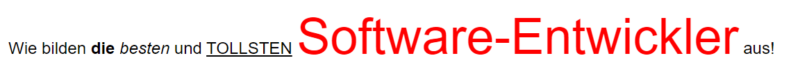
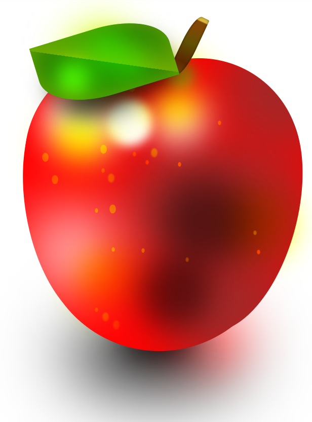
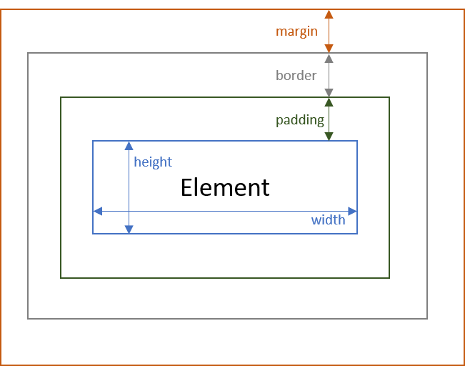

---

marp: true
theme: defalut
paginate: true
footer:

---

<style>
img[alt~="center"] {
  display: block;
  margin: 0 auto;
}
</style>

# HTML & CSS
Prof. Dr.-Ing. Andreas Heil

 Licensed under a Creative Commons Attribution 4.0 International license. Icons by The Noun Project.

v2.1.0

---

# Teil 1: Hypertext Markup Language

---

# Auszeichnungssprachen (Markup Languages)

* Ursprung (engl.): _marking up documents_
* Auszeichnungen oder Formatierungen heben sich syntaktisch unterscheidbar vom Text ab 
* Beispiele für Auszeichnungssprachen 
    * LaTeX
    * XML
    * HTML
    * JSON? 

--- 

# JSON

> JSON is a text format that is completely language independent but uses conventions that are familiar to programmers of the C-family of languages, including C, C++, C#, Java, JavaScript, Perl, Python, and many others. These properties make JSON an ideal data-interchange language.[^1]

⏩ JSON ist also keine Auszeichnungssprache

---

# HTML

* **H**yper**t**ext **M**arkup **L**anguage
* Auszeichnungselemente um den Inhalt eines Dokumentes zu beschreiben (Struktur, Formatierung)
* Markup directives to describe content (structure, formatting)
* Deklarative Sprache
* Annotationen mittels **HTML Tags** `< >`
* Groß-/Kleinschreibung ist irrelevant

Beispiel
```html
<p>Wallo Welt!</p>
```

---

# Anatomy von HTML Tags

```plain
Opening Tag     Closing Tag
    ┌┴┐           ┌─┴─┐ 
    <p>Hallo Welt!</p>
       └────┬────┘
          Inhalt
    └────────┬────────┘
          Element
```

```plain
    <p class="notes">Hallo Welt!</p>
       └─────┬─────┘
          Attribut
```

---

# Sonderzeichen

| Literal | HTML-Zeichenfolge |
| --- | --- |
| <	| \&lt; |
| >	| \&gt; |
| "	| \&quot; |
| '	| \&apos; |
| &	| \&amp; |
| nonbreaking space| \&nbsp; |

---

# HTML Dokument 

```html
<!DOCTYPE html>
<html>
  <head>
    <meta charset="utf-8">
    <title>Eine HTML-Seite</title>
  </head>
  <body>
    <p>Hallo welt!!</p>
  </body>
</html>
```

---

# Header - Meta Tag

* Informationen über das Dokument
* Wird nicht angezeigt 
* Maschinenlesebar 

## Beispiel
```html
<meta charset="utf-8">
```

---

# Meta Tag und Viewport 

* *Viewport* ist der Bereich der Seite, die der Anwender sieht 
* Abhängig vom Endgerät (Desktop, Mobilgerät)
* Kann über *meta*-Tag kontrolliert werden

## Beispiel

```html 
<meta name="viewport" content="width=device-width, initial-scale=1.0">
```

* https://www.w3schools.com/html/example_withoutviewport.htm
* https://www.w3schools.com/html/example_withviewport.htm

---

# Header - Link Tag

* Beschreibt Relation zwischen der Seite und externen Quellen 
* Oft, Verweis auf externe Ressource (Style Sheets)
* Besonderheit: Das HTML-Element ist leer und enthält nur Attribute

## Beispiel

```html
<link rel="stylesheet" href="styles.css">
```

--- 

# XHTML 

* Extensible Hypertext Markup Language 
* Erweiterung aus XML and HTML
* Wesentlich restriktiver als vanilla HTML
* Warum?
    * Fehlerhaftes HTML (z.B. fehlende schließende Tags)
    * Fehlende, inkonsistente Anführungszeichen (z.B. bei Attributen)
    * Fehlende Tags (z.B. `<head>`, `<title>` oder `<body>`)
    * Probleme bei der Interpretation durch den Browser

---

# XHTML Beispiel

```html
<?xml version="1.0" encoding="utf-8"?>
<!DOCTYPE html PUBLIC "-//W3C//DTD XHTML 1.0 Strict//EN"
 "http://www.w3.org/TR/xhtml1/DTD/xhtml1-strict.dtd">
<html xmlns="http://www.w3.org/1999/xhtml" xml:lang="en" lang="en">
  <head>
    <title>Eine XHTML Seite</title>
  </head>
  <body>
    <p>Hallo Welt!</p>
    <br />
  </body>
</html>
```

---

# XHTML - Grundlegende Regeln

* Jedes Tag muss geschlossen werden
* Kurzform für `<p></p>` ist `<p />`
* Anführungszeichen sind zwingend erforderlich
* `<html>`, `<head>`, `<title>`, und `<body>` sind verpflichtend
* HTML-Tags und Attribute in Kleinbuchstaben
* Keine »attribute minimization«

---

# Attribute Minimization

In HTML möglich 

```html
<input name="angemeldet" type="checkbox" checked />
``` 

In XHTML erforderlich

```html 
<input name="name" type="checkbox" checked="checked" />
```

---

# DOCTYPE 

* Die `<!DOCTYPE>`-Anweisung ist **kein** HTML-Tag
* Hinweis für den Browser, was er im Dokument zu erwarten hat 
* Bei HTML 4 bzw. XHTML muss ein Doctype immer auf ein DTD (Document Type Definition) verweisen
* In HTML 5 wesentlich einfacher, hier genügt
  `<!DOCTYPE html>`
* Unterschiedliche Doctypes erlauben unterschiedliche HTML-Tags[^2]

---

# HTML Übersicht

w3schools[^3]

* Als Übersicht
* Als Referenz
* https://www.w3schools.com/

---

Teil 2: Cascading Style Sheets

---

# Anti-Style

```html
<p>
  <font face="Arial">Wilkommen an der Hoschule Heilbronn</font>
  Wi
  r bilden <b>die</b>, <i>besten</i> und <u>tollsten</u> 
  <font size="+4" color="red">Software-Entwickler</font> aus!
</p>
```



Aus vielen Gründen keine gute Idee:
  * Accessibility
  * Trennung von »Code« und Darstellung
  * Und ja, das hat man »früher« so gemacht

---

# Motivation von CSS

Wie rendert der Browser eigentlich die vorherigen Tags, z.B. wo kein Font angegeben wurde?

* Browser nutzt »irgendeinen« Default 
* Das HTML enthält das *was*, der Browser kümmert sich um das *wie*
* Warum? HTML ist eine deklarative Sprache (s.o.)

Früher:
* Überschreiben von Default-Werten mit Attributen 

  ```html 
  <table border="3" bordercolor="black">
  ...
  </table>
  ```

---

# Lösung

CSS adressiert exakt diese Probleme

* Verwendung einen spezifischen Styles anstelle der Defaults in (verschiedenen) Browser
* Keine Attribute zur Darstellung an allen möglichen HTML-Tags 

--- 

# Konzepte hinter CSS 

* Inhalt ist in der HTML-Datei
* Informationen zur Formatierung in separaten Dateien (Style Sheets/.css-Dateien)
* Anwendung durch `class`-Attribute (z.B. `<p class="em">`)
* Wiederverwendung möglich: CSS-Klassen einmal definieren und an andere Stelle wiederverwenden #
* Eine zentrale Änderung am Style Sheet ermöglicht alles mit einer Änderung anzupassen 
  * Farbe, Schriftart, Größe etc.
  * Schnelle Anpassung an Kundenwünsche, Customizing, Corporate Design etc. (z.B: WordPress Themes)

---

# CSS Rules 

```plain
selektorliste {
  eigenschaft: wert;
  [weitere eigenschaft:wert; Paare]
}
```

## Beispiel

```css
strong {
  color: red;
}
```

---

# Selektoren

## Via Tag-Name

HTML: 
```html
<h1>Wilkommen an der Hochschule Heilbronn!</h1>
```

CSS: 
```css
h1 {
  color: blue
}
```

---

# Selektoren (Forts.)

## Via Klassen-Attribut

HTML:
```html
<p class="large">...</p>
```

CSS:
```css
.large {
  font-size: 18pt;
}
```

---

# Selektoren (Forts.)

## Via Tag und Klasse 

HTML:
```html
  <p class="large">...<p>
```

CSS:
```css
p.large {
  font-size: 32pt;
}
```

---

# Selektoren (Forts.)

## Via der ID eines HTML-Elements 

HTML:
```html
<p id="titel">...<p>
```

CSS:
```css
#titel {
  font-weight: bold;
}
```

---
# Pseudo Selektoren 

`hover` - Sobald das Element mit der Maus überfahren wird

```css
p:hover, a:hover {
  background-color: green;
}
```

---

# Pseudo Selektoren (Forts.)

`a:link`, `a:active`, `a:visited` - Für Links (normal, aktiv oder besucht)

```css
a:link {
  color: blue;
}

a:active {
  color: red;
}

a:visited {
  color: purple;
}
```

---

# CSS Eigenschaften 

Was kann mit CSS dargestellt werden?

* Farben, Größe, Positionierung, Sichtbarkeit etc. 
* Animationen 
* u.a.

---

# CSS Extrem Beispiele - Apfel



* 675 Zeilen CSS[^4]

---

# CSS Extrem Beispiel - Walkman


* 535 Zeilen Code[^5]
* Weiter Beispiele:
  https://css-art.com/ 
---

# CSS Extrem Beispiele - Prof AHeil


* 745 KB CSS[^6]
* Erstellt mit[^7]: https://codepen.io/emad_elsaid/pen/bCaLE

```css
 .pixels{
	border-radius: 0;
	display: inline-block;
	width: 1px;
	height: 1px;
	box-shadow: 0px 0px rgba(183,187,190,1),
                    0px 1px rgba(183,187,190,1)
                    ...
 }
  ```

---

# CSS Farben 

Attribute: `color` und `background-color`

* Mittels Rot/Grün/Blau (RGB) Intensitäten zwischen 0 und 255
* Optional Alpha-Kanal für Transparenz
* 140 Vordefinierte Farben: `red`, `blue`, `green`, `white` etc.

---

# HEX-Farben

Durch Angabe des RGB HEX-Wertes der Farbe 

```css
#c1 {background-color: #ff0000;}   /* Rot */
#c2 {background-color: #00ff00;}   /* Grün */
#c3 {background-color: #0000ff;}   /* Blau */
```

Mit Alpha/Transparenz

```css
#c1a {background-color: #ff000080;}   /* Transparent Rot  */
#c2a {background-color: #00ff0080;}   /* Transparent Grün */
#c3a {background-color: #0000ff80;}   /* Transparent Blau */
```
---

# RGB-Funktion


Via `rgb(R, G, B)` 

```css
#c1 {background-color: rgb(255, 0, 0);}   /* Rot */
#c2 {background-color: rgb(0, 255, 0);}   /* Grün */
#c3 {background-color: rgb(0, 0, 255);}   /* Blau */
```

Mit RGB und Alpha via `rgba(R, G, B, A)

```css
#c1a {background-color: rgba(255, 0, 0, 0.2);}   /* Rot mit Transparenz */
#c2a {background-color: rgba(0, 255, 0, 0.2);}   /* Grün mit Transparenz */
#c3a {background-color: rgba(0, 0, 255, 0.2);}   /* Blau mit Transparenz */
```

---

# HSL-Farben

Via `hsl(hue, saturation, lightness)`

```css
#c1 {background-color: hsl(120, 100%, 50%);}   /* Grün */
#c2 {background-color: hsl(120, 100%, 75%);}   /* Hellgrün */
#c3 {background-color: hsl(120, 100%, 25%);}   /* Dunkelgrün */
#c4 {background-color: hsl(120, 60%, 70%);}    /* Pastelgrün */
```
Mit HSL und Alpha-Kanal 

```css
#c1a {background-color: hsla(120, 100%, 50%, 0.3);}   /* Grün mit Tansparenz */
#c2a {background-color: hsla(120, 100%, 75%, 0.3);}   /* Hellgrün mit Transparenz */
#c3a {background-color: hsla(120, 100%, 25%, 0.3);}   /* Dunbkelgrün mit Transparenz */
#c4a {background-color: hsla(120, 60%, 70%, 0.3);}    /* Pastelgrün mit Transparenz */
```
---

# CSS Box Model
<style>
img[alt~="r"] {
  position: absolute;
  right: 50px;  
  top: 150px;
  width: 45%
}
</style>

* Margin und Padding sind transparent
* Gesamte Breite eines Elements =
  width + 
  padding-left + padding-right + 
  border-left + border-right + 
  margin-left + margin-right



---

# CSS Einheiten für Abstände 

| Beispiel | Einheit |
|---|---| 
| 5px | Pixel |
| 2mm | Millimeter |
| 1cm | Zentimeter |
| 0.5in | Zoll (engl. inch) (~2,54cm) |
| 5pt | Druckerpunkt (~1/72 Zoll) |

Abstände sind ansolut

---

# CSS Einheiten für (Schrift-)Größen

| Beispiel | Einheit | 
| --- | --- | 
| 2em | 2 Mal die Schriftgröße der aktuellen Elements | 
| 5rem | 5 Mal die Schriftgröße des Root-Elements |

Größen sind relativ

---

# CSS Attribute für Größen

* `width`,`height` überschreiben die Standardgröße
* `padding-top`, `padding-right`, `padding-bottom`, `padding-left`
* `margin-top`, `margin-right`, `margin-bottom`, `margin-left`
* `border-top-color`, `border-top-style`, `border-top-width`, ...

Beispiel

```css
p {
  border: 3px solid black;
}
```

---

# Positionierung

| Attribut | Beschreibung | 
| :--- | :--- | 
| `position:static` | Default, im Dokument eingebettet | 
| `position:relativ` | Relativ zur Default-Position mittels `top,`, `right`, `bottom` und `left` |
| `position:fixed` | Fixe Position auf dem Bildschirm mittels `top,`, `right`, `bottom` und `left` |
| `position:absolute` |  Relative Position zum übergeordneten Element mittels `top,`, `right`, `bottom` und `left` ||


---

# Layout 

* Früher ausschließlich über Tabellen realisiert
* Problem: Seite wurde erst gerendert, wenn gesamte Tabelle geladen war (Modem, ISDN) 

* Flexbox (Reihe oder Spalte): `display:flex`
* Grid (Reihen und Spalten): `display:grid`
  * Elemente passen sich verfügbarem platz an und schrumpfen, wenn weniger Platz zur Verfügung steht 
  * Idee für Anwendungsentwicklung: Verfügbarer Platz wird aufgeteilt
  * Grundlage für verschiedene Endgeräte und Bildschirmgrößen 
  * Später relevant Bootstrap 

---

# Grundregel bei CSS

* Der am »meisten spezifische« Selektor wird genutzt 

HTML
  ```html
  <p>Hallo Welt!</p>
  <p class="text">Kein Tag ohne CSS Probleme...</p>
  ```

CSS
  ```css
  p .text { color: green; }
  p { color: red; }
  ```

Browser
  

---

# Styles referenzieren 

* Variante 1: Style Sheet 

  ```html
  <head>
    <link rel="stylesheet" type="text/css" href="styles.css" />
    ...
  </head>
  ```

* Variante 2: Im Head für gesamte Seite 

  ```html
  <head>
    <style type="text/css">
      p .text { color: black; }
      ...
    </style>
  </head>
  ```

---

# Styles referenzieren (Forts.)

* Variante 3: Für ein einzelnes Element

  ```html
  <head>
    ...
  </head>
  <body>
    <p style="color: black; ... ">Hallo Welt</p>
  </body>
  ```

---

# Echte Welt Probleme 

* Vererbung: Manche Attribute vererben sich auf die Kind-Elemente, andere nicht
* Komposition: Viele CSS-Dateien aus unterschiedlichen Quellen (vgl. WordPress-Theme + Bootstrap + Custom-Style) (vgl. Demo)
* Nutzung von Präprozessoren zur leichteren Verwaltung (z.B. less[^8])

  ```css
  @width: 10px;
  @height: @width + 10px;

  #header {
    width: @width;
    height: @height;
  }
  ```

---

# References 

[^1]: https://www.json.org/
[^2]: https://www.w3schools.com/tags/ref_html_dtd.asp 
[^3]: https://www.w3schools.com/
[^4]: https://codepen.io/Octavector/pen/LBvyPR
[^5]: https://codepen.io/inescodes/pen/qBZbMMW
[^6]: https://github.com/aheil/hhn-webdev/blob/main/assets/aheil.css 
[^7]: https://codepen.io/emad_elsaid/pen/bCaLE
[^8]: http://lesscss.org/


