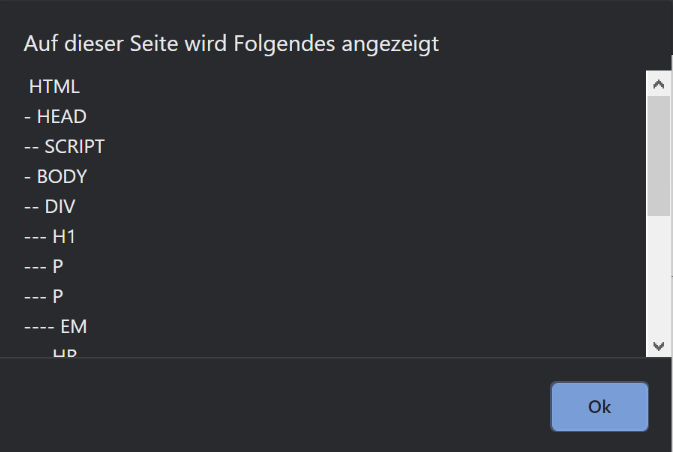

<style>
img[alt~="center"] {
  display: block;
  margin: 0 auto;
}
</style>
# DOM 
Prof. Dr.-Ing. Andreas Heil

 Licensed under a Creative Commons Attribution 4.0 International license. Icons by The Noun Project.

<!--version-->
v1.0.1
<!--/version-->

---

# Lernziele

Grundlagen des Document Object Models kennen lernen

---

# DOM - Document Object Model 

* Das Document Object Model (DOM) ist eine API, die den programmatischen Zugriff auf HTML (und XML) Dokumente ermöglicht 
* JavaScript und DOM waren ursprünglich stark gekoppelt
* Damalige Browser (Netscape oder Internet Explorer) wiesen eine eigene DOM Implementierung auf 
* Inzwischen (seit 2001) ist DOM ein eigener W3C Standard[^1]

---

# Geschichte 

* Einfaches DOM bereits in Netscape 2.0 
* Ab Netscape 4.0 und IE 4.0 divergierten die DOMs der Browser sehr stark 
* W3C DOM Level 1 wurde bereist im Oktober 1998
* Durch die Standardisierung nun nicht mehr nur via JavaScript adressierbar (auch Java, WebAssembly etc.)

---

# DOM Struktur

* Hierarchische Struktur 
* Windows als Übergeordnetes Element einer Web-Seite
* Document ist Kind mit den zu manipulierenden Elementen 

```
window
 ├─ location
 ├─ frames
 ├─ ...
 └─ document
     ├─ links
     ├─ anchors
     ├─ images
     ├─ ...
     ├─ stylesheets
     └─ body
```

---

# Adressierung von Objekten im DOM 

* Über Ihre ID oder über Ihren Namen adressiert werden (muss eindeutig in der gesamten Baumstruktur sein)
* Über den Index in der Hierarchie (Position im Array)
* Über die Beziehung zum Eltern-, Kind- oder Geschwisterelement (`parentNode`, `previousSibling`, `nextSibling`, `firstChild`, `lastChild`, `childNodes`-Array)

---

# DOM Beispiel 

* Das `erste div`-Element besitzt die ID *firstName
* Es enthält ein Textelement, dass über `childNodes[0]` adressiert werden kann 
* D.h. der Text ist kein Wert des `div`-Elements sondern der Wert des ersten Kindelements des `div`-Elements 

```html
<div id="firstName">
Andreas
</div>
<div id="lastName">
Heil
</div> 
```
⏭ [Beispiel](../assets/mouseover.html)

--- 

# Event Handler

* Wenn ein Event (dt. Ereignis) auftritt, wird ein sog. *Event Handler*[^2] ausgeführt 
* Beispiele hierfür:
  * `mouseover` oder `mouseout` 

---

# Event Handler Beispiel

```html
<!DOCTYPE html
PUBLIC "...">

<html xmlns="http://www.w3.org/1999/xhtml">
<head>
   <title>mouseover Example</title>         
   <meta http-equiv="Content-Script-Type" content="text/javascript"></meta>
</head>
<body>
   <div id="firstName"
       onmouseover="document.getElementById('firstName').childNodes[0].textContent = 'Andreas'"
       onmouseout="document.getElementById('firstName').childNodes[0].textContent = 'A.'">
       A.
       </div>
       <div id="lastName">
       Heil
       </div> 
</body>
</html>

```

---
# Hinweise

* Standardsprache für Skripte, die in Attributen wie im Beispiel 
* DOM Elemente können via Skript modifiziert werden

```html
<head>
  ...
  <meta http-equiv="Content-Script-Type" content="text/javascript"></script>
  ...├
<head>
```

---

# DOM Aufbau

```
├─ DOCTYPE: html
└─ HTML xmlns="http://www.w3.org/1999/xhtml"
   ├─ HEAD
   │  ├─ #text:
   │  ├─ TITLE
   │  │  └─ #text: mouseover Example
   │  └─ #text:
   ├─ #text:
   └─ BODY
      ├─ #text:
      ├─ DIV id="firstName"   
      │      onmouseover="document.getElementById('firstName').childNodes[0].textContent = 'Andreas'" 
      │      onmouseout="document.getElementById('firstName').childNodes[0].textContent = 'A.'"
      │ └─ #text: A.
      ├─ #text:
      ├─ DIV id="lastName"
      │ └─ #text: Heil
      └─ #text:
``` 

---

# Document Tree (1)

```html
<body>
  <div id="content">
    <h1>Prof. Dr.-Ing. Andreas Heil</h1>
    <p>Methoden des Software Engineerings</p>
    <p>Unterrichtet <em>hot s**t</em> Fächer.</p>
    <hr>
  </div>
  
  <div id="nav">
    <ul>
      <li>Web Application Development</li>
      <li>DevOps</li>
      <li>Cloud Computing</li>
    </ul>
  </div>
</body>
```

---

# Document Tree (2)

```
...
│
body
├─ div
│  ├─ h1
│  ├─ p
│  ├─ p
│  │  └─ em
│  └─ hr
└─ div
   └─ ul
      ├─ li 
      ├─ li
      └─ li
```

---

# Document Tree and Nodes 

* Jedes HTML-Dokument kann als Baum verstanden werden
* Die Dokumenten-Struktur ist relevant, z.B. für CSS-Selektoren
* Jedes Element verfügt über Eigenschaften, die durch das Node-Objekt vorgegeben  

---

# Nodes - Properties (1)

| Property | Beschreibung |
|---|---|
| *nodeType* | Nummer, die den Typ des Nodes beschreibt (s. [treeOutline.html](../assets/treeOutline.html)) |
| *nodeName* | Name des Node,s abhängig vom Typ |
| *parentNode* | Referenz zum übergeordneten Node |
| *childNodes* | Nur-lese Array mit den Kind-Nodes, Länge 0 wenn keine vorhanden |


---

# Nodes - Properties(2)

| Property | Beschreibung |
|---|---|
| *{previous\|next}Sibling*| Vorheriges bzw. nächstes Element, *null* wenn kein Element existiert |
| *attributes* | Nur-Lese Array, das *Attr*-Instanzen als Attribute des Nodes enthält |

---

# Nodes - Methoden (1)

| Methode| Beschreibung |
|---|---|
| *hasAttributes()* | Liefert wahr falls der Node Attribute besitzt |
| *hasChildNodes()* | Liefert wahr, falls der Node untergeordnete Elemente besitzt |
| *appendChilde(Node)* | Fügt den spezifizierten Node an an das Ende der untergeordneten Elemente hinzu|
| *insertBefore(Node1, Node2)* | Fügt Node1 direkt vor Node2 in die Liste der untergeordneten Elemente hinzu, |

---

# Nodes - Methoden (2)

| Methode| Beschreibung |
|---|---|
| *removeChildNode(Node)* | Entfernt den spezifizierten Node aus den untergeordneten Elementen |
| *replaceChild(Node1, Node2)* | Ersetzt Node2 durch Node1 in der Liste der untergeordneten Elemente |


---


# Traversieren des DOM 

* HTML-Element über `document.documentElement`

```js
function treeOutline() {
      return subtree(document.documentElement, 0);
}
```


```js
 function subtree(node, level) {
        var retVal = ""; 
        var elementType = window.Node ? Node.ELEMENT_NODE : 1;
        if (node.nodeType == elementType) {
            retVal += printName(level, node.nodeName);
            var children = node.childNodes;
            for (var i = 0; i < children.length; i++) {
                retVal += subtree(children[i], level + 1);
            }
        }
        return retVal;
    }
```

⏭ Beispiel: [treeOutline.html](../assets/treeOutline.html)



---

# JavaScript - Grundlagen

---

# Was ist JavaScript?

## Wikipedia[^3] sagt...

* ... dynamisch typisierte, objektorientierte, aber klassenlose Skriptsprache
* ... unter anderem auf der Basis von Prototypen 
* ... lässt sich je nach Bedarf objektorientiert, prozedural oder funktional programmieren

▶ Skriptsprache bedeutet interpretiert, wenig bis keine Deklarationen 

---

# Woher kommt JavaScript?

* Hieß ursprünglich *LiveScript* 
* Wurde zum Einbetten von Java-Applets genutzt 
* Basiert auf dem standardisieren ECMAScript 

▶ Ähnelt C mehr als Java 

---

# C vs. JavaScript 

```javascript
i = 42;
i = i * 10 + (i / 42);  

while(i >= 0) {
  sum += i*i; // Kommentar
}

for (i = 0; i < 100; i++) {
  /* Kommentar */
}

if (i < 3) {
  i = foo(i);
} else {
  i =* .01;
}
```
---

# Sprachkonstrukte

Die meisten Operatoren aus C existieren in JavaScript

```javascript
* / % + - ! >= <= > < > && || ?: 
```

Funktionen

```javascript
function foo(i)
{
  return i;
}
```

Schleifenkonstrukte 
```javascript
continue / break / return
```
---

# Dynamische Typisierung

```javascript 
var i;       // kein Typ
typeof i == 'undefined' 
i = 32;      // Jetzt typeof i == typeof 32 == 'number'
i = 'foobar' // Jetzt typeof i == typeof ''foobar' == 'string' 
i = 'true'   // Jetzt typeof i == `boolean 
```

* `use strict` *strict*-Mode erfordeert das deklarieren von Variablen (ab ECMAScript 5)[^4]
* Variablen haben immer den Typ der letzten Zuweisung 
* Primitive Typen in JS: undefined, number, string, boolean, function, object

---

# Gültigkeitsbereiche von Variablen

Zwei Gültigkeitsbereiche (engl. Scopes): *global* und *function local*  

```javascript
var globaleVariable;

function foobar() {
  val lokaleVariable; // lokaleVariable2 gibt es hier schon mit Typ 'undefined' 
  if (globaleVariable > 0) {
    var lokaleVariable2 = 2;
  }
  // lokaleVariable2 hat hier noch Gültigkeit 😱
}

```
---

TBD: Erläuterung zu Hoisting https://www.w3schools.com/js/js_hoisting.asp

---

# Probleme bei Gültigkeitsbereichen

* Globale Variablen in Browsern können Konflikte mit anderen Modulen Verursachen (gleiche global Variable)

* Hoisting TBD
---

# Referenzen

[^1]: https://dom.spec.whatwg.org/#what
[^2]: https://html.spec.whatwg.org/multipage/webappapis.html#eventhandler
[^3]: https://de.wikipedia.org/wiki/JavaScript
[^4]: https://www.w3schools.com/js/js_strict.asp