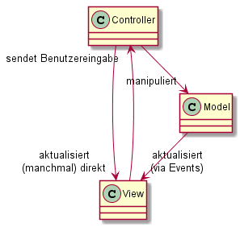
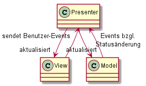

# MVVM 
Prof. Dr.-Ing. Andreas Heil

 Licensed under a Creative Commons Attribution 4.0 International license. Icons by The Noun Project.

v1.0.1

---

# Lernziele

---

# Typische Web-Anwendungen

Die meisten Anwendungen sind nach einer Schichtenarchitektur aufgebaut: 
* Die Benutzungsschnittstelle (View)
* Daten, die angezeigt und manipuliert werden (Data)
* Die Anwendungslogik, die das Verhalten der Anwendung ausmacht (Logic)

Entwurfsmuster versuchen 
* die Schichten zu entkoppeln
* die Anwendung möglichst flexibel zu gestalten 

---

# Exkurs: Architekturmuster

* MVC und MVP (s.u.) werden teilweise als Entwurfsmuster angesehen
* MVVM kein Entwurfsmuster sonder ein *Architekturmuster* 
* Architekturmuster beschreiben die Struktur bzw. Organisation einer Anwendung und die Interaktion der einzelnen Komponenten
* Entwurfsmuster hingegen beschreiben ein Teilproblem einer Software

Beispiel: Das Entwurfsmuster, das wir für die Aktualisierung anderer Objekte (z.B. einem View) verwenden ist das Observer Pattern (dt. Beobachtermuster).

---

# Model-View-Controller (MVC)

* Entstand bereits in den 1980ern in den Anwendungen von Xerox (basierend auf Smalltalk)
* Ein sog. Controller verbindet ein View und das darunterliegende Model
* Der View nutzt das Model um die Ausgabe zu erzeugen 
* Das Model enthält die Informationen 
* Ein Model kann Ereignisse (Events) versenden, wenn sie Eigenschaften des Models ändern
* Die Events können sowohl vom Controller aber auch vom View genutzt werden  

---

# Model-View-Controller 

* Unterschiedliche Aspekte de Anwendung werden getrennt (Separation of Concerns)
* Implementierungen weichen voneinander ab 

---

# Separation of Concerns - Vorteile 

* Wird für Entkopplung benötigt
* Es kann mehrere Darstellungen geben (Desktop, Web, Mobil)
* Unterschiedliche Entwickler könnten sich um unterschiedliche Teile kümmern

---

# Model 

* Enthält die Daten 
* Regelt den Zugriff und wann Änderungen stattfinden 
* Basiert meist auf Objekten der realen Welt

---

# View 

* Darstellung des Inhaltes eines Models 
* Zugriff auf die Daten (nur) durch das Model 
* Darstellung des Models obliegt vollständig dem View

---

# Controller

* Übersetzt Interaktionen mit dem View in entsprechende Aktionen
* Ausführung der Aktionen durch das Model 
* Desktop-Anwendung: Maus-Klick; Web-Anwendung: HTTP-Request
* Aktionen können sowohl Geschäftsprozesse auslösen aber zu Statusänderungen im Model führen (vgl. HATEOS)
* Abhängig von Benutzerinterkation und dem Ergebnis der Aktionen des Models stellt der Controller einen passenden View dar

---

<!-- ---
# Implementierungsbeispiel
-->

# Web Anwendungen 

* View und Controller sind hier auf Client und Server verteilt 
* Serverseitig wird ein sog. *Router* benötigt, um Anfragen auf den entsprechenden Controller weiterzuleiten 
* Im Controller wird dann die entsprechende *Action* ausgeführt   
* Abhängig vom Request Request wird dann das Model aktualisiert (vgl. HATEOS)
* Das Ergebnis wird in Form eines Views (hier HTML) angezeigt 
<!-- * Controller und Model werden dabei z.B. durch eine eigene Klasse repräsentiert, der Controller benötigt dabei Zugriff auf eine eigene Klasse, die den View (HMTL) erzeugt --> 

---

# Anwendung 

* MVC ist (war) in Web Frameworks weit verbreitet 
* MVC Frameworks: 
    * ASP.&#8203;NET MVC (.NET)
    * Rails (Ruby)
    * Spring (Java)
    * AngularJS (JS)
    * CakePHP (PHP)

---

# Model-View-Presenter (1)

* Im Gegensatz zu MVC  liegt die Präsentationslogik beim Presenter
*  Das Model ist ein Interface, in dem die Daten definiert werden, die angezeigt werden
* Ein View ist ein passives Interface, das die Daten (d.h. das Model) anzeigt und Commandos (d.h. Events) an den Presenter routed, dass dieser etwas mit den Daten »macht« 
* Der Presenter agiert sowohl für das Model aus auch den View 
* Der Presenter bereitet die Daten auf, um Sie im View anzuzeigen 
* Ein Presenter pro View 

---

# Model-View-Presenter (2)

---

# Einige Anmerkungen

* MVP unterstützt »echte« Zweiwegekommunikation mit dem View
* Jeder View implementiert irgend eine Art von View-Schnittstelle 
* Im View wird eine Instanz des Presenters referenziert
* Events werden vom View an den Presenter weitergeleitet
* Der View gibt *niemals* UI-bezogenen Code (z.B. Controls) an den Presenter weiter

---

# Model 

* Kommuniziert mit Datenbankschicht 
* Feuert Events wenn Daten generiert/erzeugt werden

---

# View 

* Rendert die Daten
* Empfängt die Events und repräsentiert die Daten
* Grundlegende Validierung (z.B. gültige E-Mail, PLZ etc.)

---

# Presenter

* Entkoppelt einen konkreten View vom Model
* Unterstützt den View bei komplexen Abläufen 
* Kommunikation mit dem Model
* Im Gegensatz zum View finden hier komplizierte Validierungen statt (z.B. Einbezug weiterer Daten)
* Frägt das Model ab (sendet Queries an das Model)
* Empfängt Daten vom Model, bereitet die Daten auf bzw. formatiert die Daten und sendet diese an die View
* MVP nutzt die gleichen Verfahren bzgl. Events wie MVC

<!-- ---

# Implementierungsbeispiel -->

---

# Einige Hinweise 

* MVP wird überwiegend in der Client-Entwicklung genutzt 
    * Google Web Toolkit (Java)
* In der Praxis ist der Unterschied zu MVC verschwindend gering

---

# Zwei Variante 

Es existieren zwei Varianten für MVP:

* Passiver View 
    * Interaktionen werden ausschließlich vom Presenter bearbeitet 
    * View wird ausschließlich vom Presenter aktualisiert 
* Supervising Controller
    * View interagiert mit dem Model (via einfachem Binding)
    * View wird durch den Presenter via Data Binding aktualisiert

---

# Model-View-ViewModel (MVVM)

* MVVM vereinigt die Vorteile von MVC (Separation of Concerns) und MVP (Data-Binding)
* Das *Model* ist identisch zu dem aus MVC 
* Der *View* ist reine Repräsentation der Daten (analog zu MVC)
* Das *ViewModel* ist eine Abstraktion des Views, das speziell auf Data Binding ausgerichtet ist 
* Die Rolle des Controllers aus MVC wird durch einen sog. *Binder* übernommen
* Aktualisierung der UI und des ViewModels (two-way)
* Binder sind Bestandteil des Frameworks und für den Entwickler i.d.R. transparent

---

# MVVM

---

# Einige Anmerkungen 

* Erstmals im Microsoft WPF Framework 
* Zweiwegekommunikation via Binding in XAML in WPF 
* ViewModel repräsentiert den View in einer »darstellungsneutralen Form«
* Direktes Binding zwischen View und ViewModel
* Ein ViewModel pro View 
* Wenn auch nicht gebräuchlich findet man manchmal Bezeichnung Model-View-Binder 
* In WPF ist XAML der Binder

---

# ViewModel

* Das ViewModel ist das »Model« des Views 
* Vermittler (engl. mediator) zwischen dem View und dem Model 
* Übernimmt die Funktion des Controllers in MVC
* Konvertiert die Daten aus dem Model für den View und umgekehrt 
* Leitet Commands (Aktionen) an das Model weiter

---

# Praxistipps 

* Durch Implementierung von abstrakter Basisklassen lässt sich sehr viel Redundanz in den Klassen einsparen
* Speziell in WPF> Kommandos erhalten ebenfalls in Interface: `ICommand` 
* Commands enthalten eine `execute` und `canExecute` Methode 
* Ob ein Commando ausgeführt werden kann (UI-Element aktiv) hängt vom Status der `canExecute` Methode ab

---

# Beispiel

Beispielprojekt

---

# Acknowledgments 

Die Folien basieren auf einer Vorlesung von Florian Rappl[^1].

---

# Referenzen

[^1]: https://patterns.florian-rappl.de/Category/Presentation%20patterns?full#slide-aa27a0a7-fb19-4ff0-850d-42fda0ca7ca9