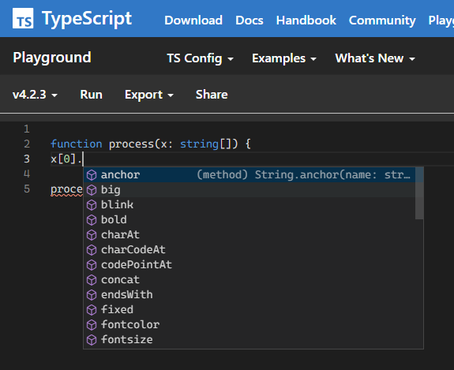
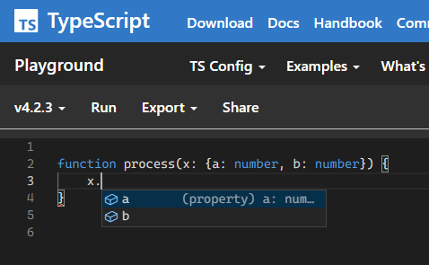
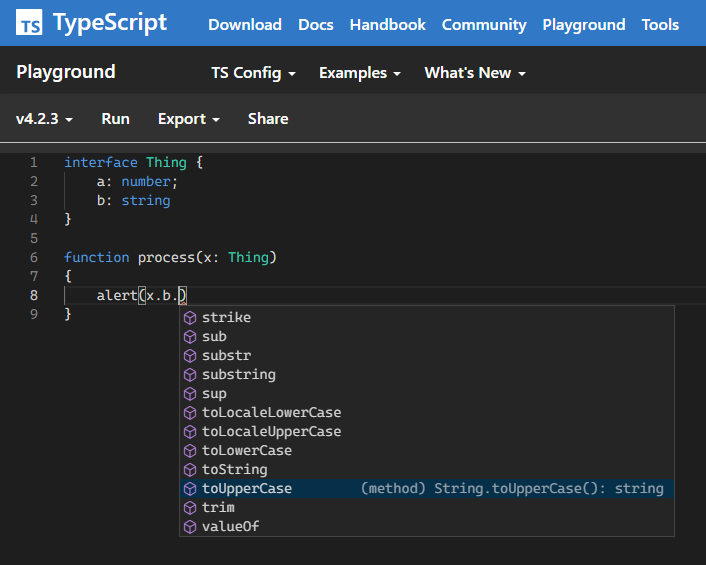
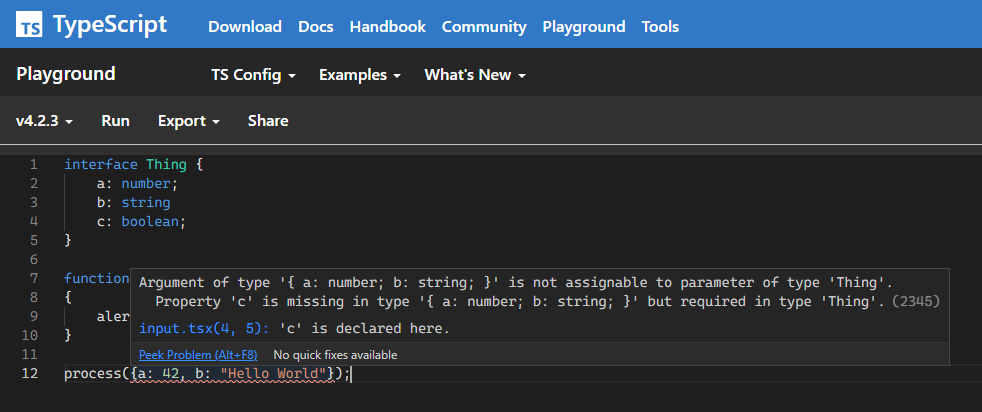

<style>
img[alt~="center"] {
  display: block;
  margin: 0 auto;
}
</style>

<style>
img[alt~="right"] {
  position: absolute;  
  right: 50px;
  top: 150px;
}
</style>

# TypeScript
Prof. Dr.-Ing. Andreas Heil

 Licensed under a Creative Commons Attribution 4.0 International license. Icons by The Noun Project.

<!--version-->
v1.0.0
<!--/version-->

---

# Lernziele

* Grundlagen der Sprache TypeScript **kennen lernen** und
* den Bezug zu JavaScript **verstehen**.


---

# Playground

**Hinweis Vorweg:** Alle Beispiele aus der Vorlesung werden im typescriptlang.&#8203;org Playground (https://www.typescriptlang.org/play) gezeigt bzw. können dort nachvollzogen werden.

---

# JavaScript

* Starkes Wachstum des Einsatzes von JavaScript innerhalb der vergangenen Jahre 
* Signifikant bessere Engines, z.B. Google V8 (mehr dazu in der Vorlesung Web Assembly)
* Zusammen Mit Web APIs und HTML 5 als UI eine vollständige und umfangreiche Programmierplattform
 


---

# Probleme

* Die Entwicklung großer (engl. application scale) JavaScript-Anwendungen ist schwer
* JavaScript wurde nicht entworfen um große Anwendungen zu entwickeln
* JavaScript ist eine Script-Sprache (d.h. wird interpretiert) 
* Keine statische Typisierung 


---

# Probleme (Forts.)

* Es fehlen grundsätzliche Möglichkeiten um 
  * den Code zu strukturieren und 
  * um eine umfangreiche Code-Basis zu verwalten 

* Beispiele
  * Klassen
  * Module, Pakete o.ä.
  * Schnittstellen (engl. interface)


---

# Konsequenz 

* Entwickler haben z.B.
  * Google GWT[^1] (Google Web Toolkit) für Java verwendet
  * ScriptSharp[^2] (Script#) genutzt um aus C# um JavaScript zu generieren
* Nutzen andere Frameworks oder andere Tools um Entwicklungsumgebungen wie Eclipse zur Entwicklung umfangreicher Anwendungen zu nutzen

Konsequenz: Die Anwendung wurde nicht in JavaScript entwickelt 

---

# Ziel von TypeScript 

> TypeScript is a language for application scale JavaScript development. 

> TypeScript is a typed superset of JavaScript that compiles to plain JavaScript. - A. Hejlsberg, 2017

---

# TypeScript 

* Kompilierter JavaScript Code läuft in allen Browsern, allen Betriebssystemen 
* Compiler selbst ist OOS
* JavaScript Code *ist* TypeScript Code (d.h. JS kann direkt in TypeScript Code kopiert werden)
* Alle JavaScript Bibliotheken (einschl. Node) funktionieren direkt in TypeScript 
* Statische Typen, Klassen, Module (optional, sind zur Laufzeit nicht mehr vorhanden)
* Kompiliert direkt zu JavaScript, d.h. verursachen keine "Kosten" zur Laufzeit 

--- 

# TypeScript Typsystem

```JavaScript
function process(x) {
  x.name = "foo";
  var v = x + x;
  alert(v);
}
```

* *x* könnte alles sein (Typ *any* in JavaScript)

---

# TypeScript Typsystem

* Mittels Google Closure könnte ein Typsystem eingeführt werden

```JavaScript
/**
 * @param {string}
 */

function process(x) {
  x.name = "foo";
  var v = x + x;
  alert(v);
}
```

* Wer erkennt hier Probleme?

---

# TypeScript Typsystem

```typescript
function process(x: string) {
  x.name = "foo"; // Property 'name' does not exist on type 'string'.(2339)
  var v = x + x;
  alert(v);
}
```

---


# TypeScript Typsystem

```typescript
function process(x: boolean) {
  x.name = "foo"; // Operator '+' cannot be applied to types 'boolean' and 'boolean'.(2365)
  var v = x + x;
  alert(v);
}
```

---

# TypeScript Typsystem



* Typ *String Array* wird inferriert 
* Compiler (IDE) kann passende
  Operationen anbieten 
* Ungültige Operationen werden 
  erkannt 


---

# TypeScript Typsystem

```typescript
function process(x: () => string) {
    x().toUpperCase();
    alert(x)
}
```
* *x* ist Funktion, die 
  ein String zurückliefert

---

# TypeScript Typsystem



* *x* hat zwei Properties
  * *a* vom Typ *number*
  * *b* vom Typ *number*

---

# TypeScript Typsystem - Strukturierte Typen

```typescript
interface Thing {
    a: number;
    b: string
}

function process(x: Thing)
{
    alert(x.b)
}
```

---

# TypeScript Typsystem - Strukturierte Typen



---

# Wie aufrufen? 

```typescript
interface Thing {
    a: number;
    b: string
}

function process(x: Thing)
{
    alert(x.b)
}

process({a: 42, b: "Hello World"});
```

---

# Wie aufrufen? (Forts.)

```typescript
interface Thing {
    a: number;
    b: string
}

function process(x: Thing)
{
    return x.a;
}

process({a: 42, b: "Hello World"});
```

* Für Rückgabewert von *process* wurde kein Typ angegeben 
* Compiler inferiert, dass es sich um *number* handelt (Typinferenz)

---

# Interfaces 

```typescript
interface Thing {
    a: number;
    b: string
    c: boolean;
}

function process(x: Thing)
{
    alert(x.b)
}

process({a: 42, b: "Hello World"});
```

* Wer sieht den Fehler?

---

# Interfaces 



---

# Optional Property 

```typescript
interface Thing {
    a: number;
    b: string
    c?: boolean;
}

function process(x: Thing)
{
    alert(x.b)
}

process({a: 42, b: "Hello World"});
```

* Problem gelöst...
* Bei der Verwendung optionaler Properties: Vor Aufruf prüfen ob *undefined*

---

# Interfaces (Funktionen)

```typescript
interface Thing {
    a: number;
    b: string
    foo(s: string);
}

function process(x: Thing)
{
    alert(x.foo("bar"));
    alert(x.foo("bar", 42)); // Expected 1 arguments, but got 2.(2554)
}

```

---

# Interfaces (Optionale Argumente))

```typescript
interface Thing {
    a: number;
    b: string
    foo(s: string, n?: number);
}

function process(x: Thing)
{
    alert(x.foo("bar"));
    alert(x.foo("bar", 42)); 
}

```

---

# Interfaces (Überladen v. Funktionen)

```typescript
interface Thing {
    a: number;
    b: string
    foo(s: string): string;
    foo(n: number): number;
}

function process(x: Thing)
{
    alert(x.foo('bar'));
    alert(x.foo(42));
}
```

---

# Interfaces (Überladen v. Funktionen)

```typescript
interface Thing {
    a: number;
    b: string
    foo: {
        (s: string): string;
        (n: number): number;
    }
}

function process(x: Thing)
{
    alert(x.foo('bar'));
    alert(x.foo(42));
}
```

* In Wirklichkeit heißt es, es gibt zwei Signaturen von *foo*

---

# Alles aus JavaScript ist möglich ... 


```typescript
interface Thing {
    a: number;
    b: string
    foo: {
        (s: string): string;
        (n: number): number;
        data: any;
    };
    new (s: string): Element;
    [index: number]: Date;
}

function process(x: Thing)
{
    var e = new x("foo");
    var d = x[0].toDateString();
}
```
... auch wenn es kein Sinn ergibt!

---

# Klassen

```typescript 
class Point {
  x: number;
  y: number;
  constructor(x: number, y: number) {
    this.x = x;
    this.y = y;
  }
}

var p = new Point(10, 20);
p.x = 4;
p.y = 2;
```

* Angelehnt an ECMAScript 6

---

# Klassen in ESCMAScript 6 

```javascript
"use strict";
class Point {
    constructor(x, y) {
        this.x = x;
        this.y = y;
    }
}
var p = new Point(5, 10);
p.x = 10;
p.y = 20
```

---

# Klassen "vor" ECMAScript 6 

```javascript
var Point = (function() {
    function Point(x, y) {
        this.x = x;
        this.y = y;
    }
    return Point;
})();
var p = new Point(5, 10);
p.x = 10;
p.y = 20;
```

---

# TypeScript Klassen: Methoden und Properties

```typescript 
class Point {
  x: number;
  y: number;
  constructor(x: number, y: number) {
    this.x = x;
    this.y = y;
  }
  dist1() { return Math.sqrt(this.x * this.x + this.y * this.y)}
  get dist2() { return Math.sqrt(this.x * this.x + this.y * this.y)}
}

var p = new Point(10, 20);
var d1= p.dist1();
var d2 = p.dist2;
```

* Identisch in ECMAScript 6 

---

# TypeScript static 

```typescript
class Point {
  x: number;
  y: number;
  constructor(x: number, y: number) {
    this.x = x;
    this.y = y;
  }
  dist1() { return Math.sqrt(this.x * this.x + this.y * this.y)};
  get dist2() { return Math.sqrt(this.x * this.x + this.y * this.y)};
  static origin = new Point(0,0);
}

var p = new Point(10, 20);
var o = Point.origin;
```

---

# TypeScript static 

In JavaScript: 

```javascript
"use strict";
class Point {
    constructor(x, y) {
        this.x = x;
        this.y = y;
    }
    dist1() { return Math.sqrt(this.x * this.x + this.y * this.y); }
    ;
    get dist2() { return Math.sqrt(this.x * this.x + this.y * this.y); }
    ;
}
Point.origin = new Point(0, 0);
var p = new Point(10, 20);
var o = Point.origin;
```

---

# Private Members

```typescript
class Point {
  x: number;
  y: number;
  private color: string;
  constructor(x: number, y: number) {
    this.x = x;
    this.y = y;
    this.color = 'red';
  }
  dist1() { return Math.sqrt(this.x * this.x + this.y * this.y)};
  get dist2() { return Math.sqrt(this.x * this.x + this.y * this.y)};
  static origin = new Point(0,0);
}

var p = new Point(10, 20);
var o = Point.origin;
```

* In der IDE / Compiler nicht nutzbar ABER

---

# Private Members (Forts.)

```javascript
"use strict";
class Point {
    constructor(x, y) {
        this.x = x;
        this.y = y;
        this.color = 'red';
    }
    dist1() { return Math.sqrt(this.x * this.x + this.y * this.y); }
    ;
    get dist2() { return Math.sqrt(this.x * this.x + this.y * this.y); }
    ;
}
Point.origin = new Point(0, 0);
var p = new Point(10, 20);
var o = Point.origin;
```

* In JavaScript ein ganz normales Feld und auch so nutzbar! 

--- 

# Automatisches Initialisieren 

```typescript
class Point {
  x: number;
  y: number;
  constructor(x: number, y: number) {
    this.x = x;
    this.y = y;
  }
```

identisch mit 

```typescript
class Point {
  constructor(public x: number, public y: number) {
  }
```

Nice! 

---

# Automatisches Initialisieren (Forts.)

Mit Default-Werten initialisieren: 

```typescript
class Point {
  constructor(public x: number = 0, public y: number = 0) {
    ...
}


var p = new Point(); // kein Fehler, wird mit (0,0) initialisiert! 
```

---

# Vererbung 

```TypeScript
class Point3D extends Point { }
```
* Analog zu ECMAScript 6 
* Davor ca. 30 Zeilen JavaScript Voodoo 


```TypeScript
class Point3D extends Point { 
  constructor(x: number, y: number: public z: number) {
    super(x, y);  // Hier wird der Parent-Konstruktor aufgerufen
  }
  dist() { // Methoden aus der Parent-Klasse können überschrieben werden
    var d = super.dist();
    return Math.sqrt(d * d + this.z * this. z);
  }
}
```
---

# Moduls 

```typescript
module Math2D{ 
   export class Point {
    constructor(public x: number = 0, public y: number = 0) {        
    }
  }
}

var p = new Math2D.Point();
```
---

# Zusammenfassung

* Formalisiert das dynamische Typsystem von JavaScript 
* Erlaubt das Definieren struktureller Typen (Interfaces, Klassen etc.)
* **Achtung:** Nicht typsicher!
* Viele Funktionen inzwischen in ECMAScript 6
---

# Referenzen

[1] http://www.gwtproject.org/
[2] https://github.com/nikhilk/scriptsharp

[^1]: http://www.gwtproject.org/
[^2]: https://github.com/nikhilk/scriptsharp
