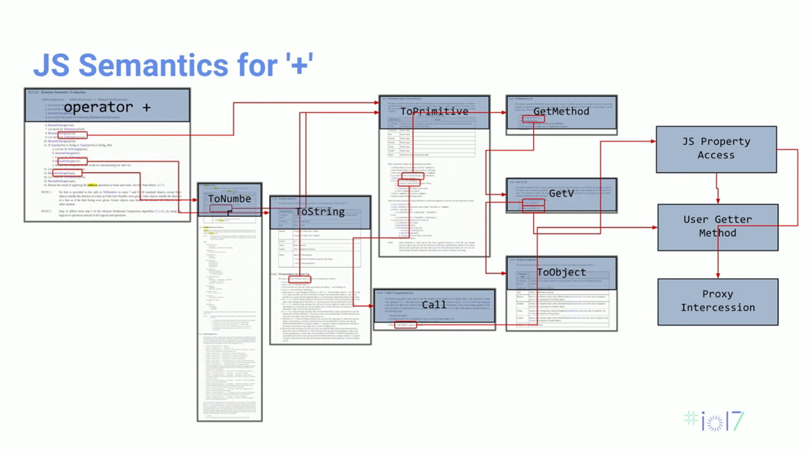

<style>
img[alt~="center"] {
  display: block;
  margin: 0 auto;
}
</style>
# WebAssembly 
Prof. Dr.-Ing. Andreas Heil

 Licensed under a Creative Commons Attribution 4.0 International license. Icons by The Noun Project.

<!--version-->
v1.1.0
<!--/version-->

---

# Lernziele

Den Ursprung und die grundlegende Funktionsweise von WebAssembly verstehen.

---

# First Things First 

* Niemand entwickelt »in« WebAssembly.
* WebAssembly ist ein »Compiler Target« 

---

# Was ist ein »Compiler Target«?

* Compiler sind Programme die Code von einer Sprache in eine andere Übersetzen 
* Auf Englisch: Die Quellsprache heißt  »Source«, die Zielsprache »Target«

| Compiler | Source | Target |
| --- | --- | --- |
| javac | Java | Bytecode | 
| GCC | C | X86 Assembler |
| GAS | X86 Assembler| X86 Objekt-Code |
| Eiffel Compiler | Eiffel | C |
| WebAssembly Compiler | * | WebAssembly |

---


# Warum benötigen wir WebAssembly?

* Was wir eigentlich wollen: Geschwindigkeit und bessere Performance 
* Was wir haben: JavaScript als Flaschenhals
* Warum entwickeln App Entwickler überwiegend in den nativen C und C++ Bibliotheken (z.B. für Daten- und Bildverarbeitung) 
* Was wäre, wenn wir eine solche App nehmen könnten und Sie mittels Cross-Compiling in den Browser bringen könnten? 
* Vereinfacht ausgedrückt ist genau das WebAssembly

--- 


[^1]

--- 

# Probleme mit JavaScript

* Moderne Engines versuchen die Semantik so kurz wie möglich zu halten 
* Was allerdings erreicht werden soll: ein »+« soll in eine einzige CPU-Instruktion konvertiert werden (im Vergleich zur vorherigen Folie)

* Moderne Engines try to keep it as short as possible
* Goal '+' should be converted to  single CPU instruction 
* op 
---

# Geschwindigkeit

* Google hat untersucht, dass die Top Android Anwendungen allesamt in C++ entwickelt wurden
* Ursache hierfür: Performance- und Geschwindigkeitsvorteile 
* WebAssembly ist hier annähernd so schnell wie native Anwendungen 
  * Faktor 1,2 trotz Sandbox und Sicherheitseinschränkungen 
  * In allen vier Browser-Engines verfügbar

---

# Warum keine Plugins? 

* Flash 
* JVM
* Silverlight

Problem: Sogar in einer Sandbox sind Plugins schwer zu kontrollieren
  * Plugins funktionieren nicht mit mit den verschiedenen Web APIs
    * Z.B. Kamera API, Location API
  * Viel wichtiger: Plugins lauen nicht auf Mobilgeräten
  
 ---

 # Vorläufer

* Google Native Client: Target für Compiler Code, allerdings 
  * Ohne Unterstützung der Web APIs
  * Nur für Chrome verfügbar

* Mozilla: asm.js 
  * Kompiliert C++ auf minimales JavaScript
  * JavaScript Engine kompiliert dies in relativ schnellen nativen Code
  * Problem: Starke unterschiede zwischen JavaScript Frameworks
  * Keine Cross-Browser Kompilierung 

---

# asm.js

```javascript
function add1(x) {
  x = x|0; // x : int
  return (x + 1)|0;
}
```

---

# JavaScript Lazy Compilation


---

# WebAssembly Ziele 

* Kompakt ⏩ Kleiner als minifizierte asm.js
  * aktuell ist WebAssembly Module kleiner als gezippte asm.js
* Einfache Verifikation ⏩ Sicherheit gewährleisten 
  * In einem Durchlauf durch den Bytecode sicherstellen, dass keine Zugriffe außerhalb der Grenzen des ausgeführten Codes stattfinden
    * JS Engines kompilieren Stück für Stück (abh. von Engine)
* Einfach zu kompilieren ⏩ Ein-Phasen-Compiler
* Erweiterbar ⏩ Neuer Bytcode und neue Typen
  * Vom Design her vorgesehen

---

# Sprachumfang von WebAssembly

* Datentypen
  * `void`, `i32`, `i64`, `f32`, `f64`
  * `i64` und `f64` können in C++ genutzt werden, nicht verfügbar in JS
* Speicher
  * lineare (zusammenhängender Speicher)
  * Hardware Boundaries bei 32Bit WebAssembly auf 64Bit-Systemen (keine Laufzeiteinbußen)

---

# Operationen & Kontrollfluß

* Operationen
  * i32: + - * / / << >> >>> etc
  * i64: + - * / / << >> >>> etc
  * f32: + - * / sqrt ceil floor 
  * f64: + - * / sqrt ceil floor 
  * conversions (Casting)
  * load store ch
  * call_direct call_indirect

* Strukturierter Kontrollfluss 
  * if loop block br switch

--- 

# WebAssembly ist eine »Stack Machine« 

Wenig überraschend: 

* »Stack Machine«
  * Funktionsweise Stack 
  * Populär für virtuelle Maschinen, da extrem einfach zu implementieren und in virtuellen Maschinen sehr schnell
* »Register-based Machine«
  * Funktionsweise via Register
  * Meistens Hardware vorbehalten (vgl. Vorlesung Betriebssysteme)
  * Vorteil: Kompilierter Code kann optimiert werden 

  ---

# Stack vs. Register (1)[^2] 

* Register-based 
  ```assembly
  LOAD R4,#2 ;Lade 2 in Register 4
  LOAD R5,#4 ;Lade 4 in Register 5
  ADD R4,R5  ;Addiere R4 and R5, speichere den Wert in R4
  ```

---

# Stack vs. Register (2)[^2] 


* Stack
  ```assembly
  PUSH #2 ;Push 2 auf den Stack
  PUSH #5 ;Push 5 auf den Stack
  ADD     ;Pop zwei Werte, addiere diese und push das Ergebnis auf den Stack
  ```

---

# Abschließende Betrachtung
## Web Assembly Raytracer


https://mtharrison.github.io/wasm-raytracer/

---

# Acknowledgments

Die Folien basieren auf einem Vortrag der Google I/O 2017[^1].


---

# Referenzen

* WebAssembly auf GitHub: https://github.com/WebAssembly
* WebAssembly Playground: http://ast.run/


[^1]: https://www.youtube.com/watch?v=6v4E6oksar0&t=241s
[^2]: https://www.quora.com/What-is-difference-between-register-machines-stack-machines